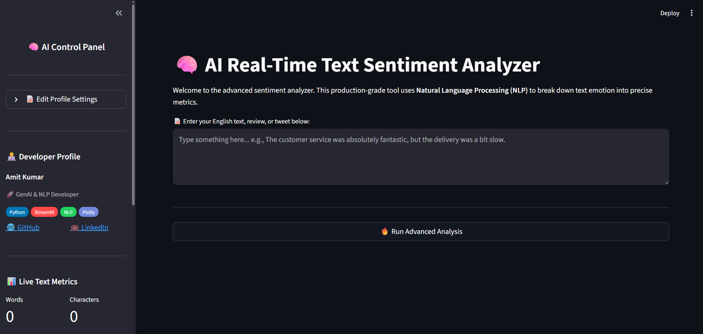
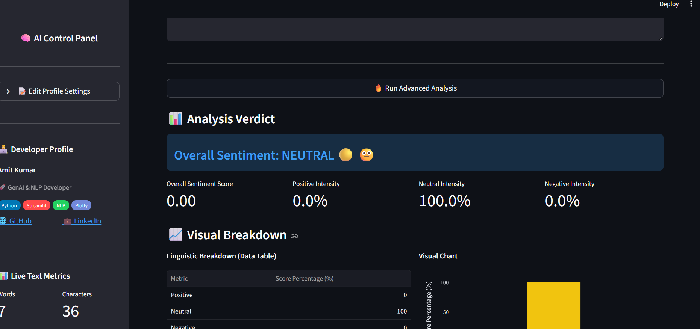

# 🧠 AI Real-Time Text Sentiment Analyzer

[](https://www.python.org)
[](https://streamlit.io)
[](https://www.nltk.org)

An advanced, production-ready **Natural Language Processing (NLP)** web application designed to break down textual human emotions into actionable metrics. Powered by **NLTK's VADER (Valence Aware Dictionary and Sentiment Reasoner)** engine and styled with a professional, reactive **Streamlit** dashboard.

---

## 📸 Dashboard Preview

| Main Landing Screen | Advanced Analytics View |
| :---: | :---: |
|  |  |

---

## ⚡ Core Features & Capabilities

* **Real-Time Sentiment Extraction:** Evaluates continuous text strings to determine a decisive emotional polarity: **Positive (`🟢 😊`)**, **Negative (`🔴 😡`)**, or **Neutral (`🟡 😐`)**.
* **Dynamic Control Panel:** Features an expandable profile settings block in the sidebar where developers can update their name, role, skills, and social handles in real-time.
* **On-the-Fly Text Metrics:** Instantly counts words and characters as you type via high-performance Streamlit Session State bindings.
* **Granular Intensity Scoring:** Separates context into positive, neutral, and negative intensity percentages alongside a mathematical **Compound Score**.
* **Interactive Visualization:** Integrates responsive, clean data tables and dynamic Plotly Express charts.
* **Report Export Pipeline:** Generates and encodes structured CSV files directly within the browser for quick downloads.
* **Adjustable Sensitivity Engine:** Includes a slider to manipulate the **Neutral Zone Threshold** mathematically altering the rule-based decision logic.

---

## 🏗️ System Architecture & Workflow

The application follows a modular, client-server layout optimized for low latency and state management.

```mermaid
graph TD
    A[User Inputs Text] -->|Session State Sync| B(Sidebar Live Metrics)
    A -->|Trigger Run Button| C{Engine Controller}
    C -->|Check Model Cache| D[load_vader Cached Function]
    D -->|NLTK VADER Parser| E[Calculate Polarity Scores]
    E -->|Compound Score Comparison| F{Threshold Logic Evaluator}
    F -->|> Threshold| G[🟢 POSITIVE Verdict]
    F -->|< -Threshold| H[🔴 NEGATIVE Verdict]
    F -->|In-between| I[🟡 NEUTRAL Verdict]
    G & H & I --> J[Plotly Express Rendering Engine]
    G & H & I --> K[Pandas Dataframe & CSV Generator]
    J --> L((Interactive Dashboard UI))
    K --> L
